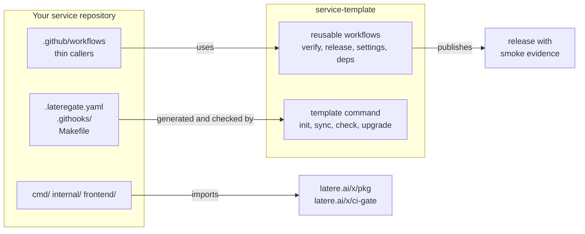

# service-template

[](https://github.com/latere-ai/service-template/actions/workflows/template.yml)
[](LICENSE)

**A template for a production Go service with an optional Bun and React
frontend.** It gives a new service what every service needs and nobody wants
to write twice: typed configuration, observability, probes and graceful
shutdown, a lint and coverage gate, a container image, a tag-driven release
that deploys and smokes before it publishes, repository settings as code, and a
spec-driven workflow.

It is not a starter kit you copy once and forget. The files it generates stay
owned by the template, a drift check proves a service still matches the
version it declares, and a fix made here reaches every service through one
command.

## Status

No release has been tagged yet. The generator, the skeleton it ships, the
reusable pipelines, and a generated reference service are in this repository,
and `make all` builds and tests them together. A service can be scaffolded and
developed today from a checkout of this repository.

Two parts wait for the first `v1` release:

- The caller workflows a service commits pin `@v1`, which resolves only once
  that tag exists. Until then, pin the reusable workflows to a commit of this
  repository.
- The `make template-check` target a new service carries cannot install the
  `template` command yet. Run the drift check from a checkout of this
  repository instead, as [Keeping a service current](#keeping-a-service-current)
  shows.

## Start a service

You need Go 1.27 or newer, git, and GNU Make. A service with a frontend also
needs [Bun](https://bun.sh), and `make dev` needs a container engine that
speaks compose, such as Docker or Podman.

```sh
git clone https://github.com/latere-ai/service-template.git
cd service-template
go run ./cmd/template init \
  -C ../my-service \
  -module github.com/acme/my-service \
  -name my-service \
  -profile service \
  -features frontend,database \
  -version v0.1.0
```

`init` writes `.template.yaml`, every file the profile and the selected
features declare, and `template.lock`. `-version` is the template version the
new service records. A build from a checkout carries no release version of its
own, so pass one; `v0.1.0` is the lowest the reusable pipelines accept.

Then, in the new repository:

```sh
cd ../my-service
git init
cp .env.example .env
make dev    # dependencies, migrations, seed data, and the service with live reload
make        # the full local gate
```

The new repository's own `README.md` and `CONTRIBUTING.md` take it from there.
[`docs/adopting.md`](docs/adopting.md) lists what to change first, how to wire
the pipelines, and which files you own.

## Profiles and features

A profile is the shape of the repository and is fixed at scaffold time.
Features are switched on with `-features` and are independent of each other.

| Profile | What it scaffolds | Features it accepts |
| --- | --- | --- |
| `service` | an HTTP service in Go, with deploy manifests and the release pipeline | all five |
| `library` | a Go module of importable packages, with the quality gate | none |
| `frontend-only` | a Bun and React application with no Go backend | `frontend` (always on), `seo`, `i18n` |

| Feature | What it adds |
| --- | --- |
| `frontend` | Bun, React, TypeScript, Vite, and Vitest, served by the Go binary |
| `seo` | a build-time prerender that emits crawlable HTML, a sitemap, and structured data; needs `frontend` |
| `i18n` | message catalogs, locale negotiation, and a completeness gate; needs `frontend` |
| `database` | Postgres through pgx, migrations, and a migration command |
| `background` | scheduled jobs, queue consumers, and one-shot commands that share the service lifecycle |

A scaffold with no feature selected still builds: the entry point reaches the
store, the frontend, and the job runner through seams that exist only when the
feature that owns them was selected.

## What a new service gets



- **Backend.** Go 1.27, a fixed module layout, typed configuration read from
  the environment, graceful shutdown, `/livez`, `/readyz`, and a `/version`
  endpoint that reports the version, commit, and build time, and OpenTelemetry
  traces, metrics, and trace-correlated logs.
- **Quality gates.** The shared gates of `latere.ai/x/ci-gate`, pinned in
  `go.mod` and configured in one `.lateregate.yaml`: formatting,
  modernization, the shared `golangci-lint` set, per-package coverage, the
  suite with only the toolchain on `PATH`, the suite against an empty
  `TMPDIR`, outbound tracing, and the spec tree. The pipeline adds `go vet`,
  `govulncheck`, CodeQL, and the race detector. Each gate runs on a
  workstation exactly as it runs in CI.
- **Delivery.** A multi-stage container image with a software bill of
  materials, build provenance, and a keyless signature. A version tag starts
  one pipeline that gates the tag, builds, deploys, smokes the live service,
  rolls back when the smoke fails, and publishes the release last, with the
  smoke output attached as evidence.
- **Repository settings as code.** Branch protection, required checks,
  ownership, and merge rules are declared in the repository and applied by a
  workflow, so the gates are binding rather than advisory.
- **Documentation that stays current.** The configuration reference and the
  API reference are generated from the code, and a check target fails when a
  committed copy is stale, a link does not resolve, or a diagram does not
  render.
- **A spec workflow.** A spec directory with a lifecycle for each spec, and a
  validator that holds the index to the files.

## Keeping a service current

The template reaches a service through three layers, and each has its own
update path:

| Layer | What it is | How a service stays current |
| --- | --- | --- |
| Workflows | the reusable `workflow_call` pipelines in this repository | the service's thin callers pin a tag; a fix lands here |
| Generated files | `.lateregate.yaml`, git hooks, `make/` fragments, the Dockerfiles, the callers, and the rest of what the template owns | `template sync` rewrites them; `template check` fails on drift |
| Libraries | the Go packages the skeleton imports from `latere.ai/x/pkg`, and the gate in `latere.ai/x/ci-gate` | ordinary dependency updates |

Run the command from a checkout of this repository at the version the service
declares, and point it at the service with `-C`:

```sh
go run ./cmd/template check -C ../my-service     # compare; changes nothing
go run ./cmd/template sync -C ../my-service      # rewrite generated files
go run ./cmd/template upgrade -C ../my-service -version v0.2.0
```

`check` exits 0 when the repository is clean, 3 when it edited a generated
file, 4 when it is behind the template, and 1 when the check could not run.
`upgrade` records the new version, syncs, and prints the diff to review.

## Design principles

**Central logic, local variability.** A reusable workflow owns ordering and
orchestration. A service declares what to build and what "live" means through
standard directories and scripts, not a long list of workflow inputs.

**Drift is detected, not hoped against.** Every file the template generates is
regenerable, and the check proves the copy in the repository still matches the
version it claims.

**Every gate fails loudly.** A skipped test, an unreachable database, or a
missing secret fails the job. A gate that passes when it cannot run is not a
gate.

**No provider lock-in in the core.** Authentication, storage, and telemetry
backends sit behind interfaces the template defines and does not implement for
one vendor.

## Documentation

| | |
| --- | --- |
| [Adopting the template](docs/adopting.md) | scaffolding, the first changes, wiring the pipelines, and keeping a service current |
| [The template contract](docs/contract.md) | what the template owns and what a service owns, file modes, drift verdicts, and the compatibility promise |
| [`examples/`](examples) | the caller workflows a service commits |
| [`example/`](example) | a reference service generated with every feature on; `make example` proves it matches a fresh generation |
| [`CONTRIBUTING.md`](CONTRIBUTING.md) | changing the template itself |
| [`specs/`](specs/README.md) | the design records behind each part |

## Contributing

Issues and pull requests are welcome. [`CONTRIBUTING.md`](CONTRIBUTING.md)
covers how this repository fits together, the build, and how a change to the
skeleton reaches services. Report a vulnerability through
[`SECURITY.md`](SECURITY.md), not in a public issue.

## License

MIT. See [`LICENSE`](LICENSE).
