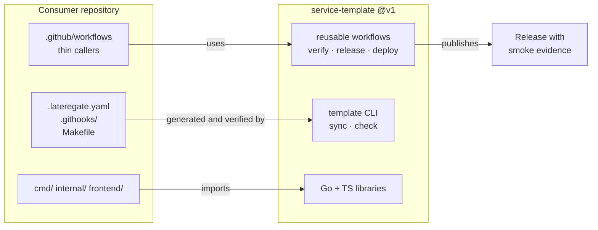

# service-template

A production service template for a Go backend with a Bun + React frontend.
It gives a new service the parts that every service needs and that nobody
wants to write twice: lint and static analysis, a test and coverage gate,
configuration, observability, a container image, a tag-driven release with
deploy evidence, and a spec-driven development workflow.

The template is not a starter kit you copy once and forget. It has three
layers, and each layer keeps working after day one:

| Layer | What it is | How a consumer stays current |
| --- | --- | --- |
| **Workflows** | Reusable `workflow_call` pipelines for verify, release, and deploy | Consumer keeps a thin caller pinned to `@v1`; fixes land centrally |
| **Materialized files** | `.lateregate.yaml`, git hooks, `Makefile` fragments, service skeleton | `template sync` rewrites them; `make template-check` fails CI on drift |
| **Libraries** | Small Go and TypeScript packages the skeleton imports | Ordinary dependency version bumps |

## Status

Implemented. The generator, the skeleton, the reusable pipelines, and a
generated reference service are in the tree and build together.

| Part | Where | State |
| --- | --- | --- |
| Generator and drift check | [`cmd/template/`](cmd/template), [`internal/generator/`](internal/generator) | `init`, `sync`, `check`, `upgrade`, `manifest` |
| Skeleton | [`skeleton/`](skeleton) | 346 declared files; a compiling Go module with its own tests |
| Reusable pipelines | [`.github/workflows/`](.github/workflows) | verify, release, deps, settings, all `workflow_call` |
| Caller examples | [`examples/`](examples) | the thin files a consumer commits |
| Reference service | [`example/`](example) | generated with every feature on, regenerated and diffed by `make example` |
| Specs | [`specs/`](specs/README.md) | 30 design specs, one aspect per spec |

The skeleton is a self-contained Go module under the module path
`example.com/service`, so the shipped code compiles and its tests run in this
repository's own CI. Generation rewrites the module path and the service name
and renders the `.tmpl` files; it is a mechanical transform of code that was
already verified.

Run `make all` to build both modules, run both test suites, regenerate the
reference service and diff it against the committed tree, and lint everything
against the shared `golangci-lint` configuration, which both modules render on
every run rather than commit.

## Scaffolding a service

```sh
go run ./cmd/template init \
  -C ../my-service \
  -module github.com/acme/my-service \
  -name my-service \
  -profile service \
  -features frontend,database
```

The command writes `.template.yaml`, every file the profile and the selected
features declare, and `template.lock`. Afterwards, inside the new repository:

- `template check` reports drift against the pinned version, with a distinct
  exit code for a local edit and for being behind the template.
- `template sync` rewrites the generated files to the pinned version.
- `template upgrade` moves to a newer version and prints the diff.

Features are additive and independent. A scaffold with no feature selected
still builds and passes its own gates: the entry point reaches the store, the
frontend, and the job runner through seams that only exist when the feature
that owns them was selected.

## What a consumer service gets



- **Backend.** Go 1.27, a fixed module layout, typed configuration, graceful
  shutdown, health and readiness probes, a `/version` endpoint that reports the
  built commit, OpenTelemetry traces, metrics, and trace-correlated logs.
- **Quality gates.** The shared gates from `latere.ai/x/ci-gate`, pinned in
  `go.mod` and configured in one `.lateregate.yaml`: formatting, modernization,
  the org's `golangci-lint` set, per-package coverage, the suite with only the
  toolchain on `PATH`, the suite against an empty `TMPDIR`, outbound tracing,
  and the spec tree. Plus `go vet`, `govulncheck`, CodeQL and race-enabled
  tests. Every one of them runs on a workstation exactly as it runs in CI.
- **Frontend.** Bun, React, TypeScript, and Vite, with Vitest, an
  internationalization baseline, and a build-time prerender that emits crawlable
  HTML, a sitemap, and structured data for the public routes.
- **Delivery.** A multi-stage container image with a software bill of materials,
  build provenance, and a signature. A version tag starts one pipeline that
  verifies, builds, deploys, smokes the live surface, and only then publishes
  the release with the smoke output attached as evidence.
- **Background work.** Scheduled jobs, queue consumers, and one-shot commands
  share the service lifecycle, run once across replicas, and report the signal
  that catches a job which silently stopped.
- **Repository settings as code.** Branch protection, required checks,
  ownership, and merge rules are declared and applied, so the gates are binding
  rather than advisory.
- **Process.** A spec directory, a lifecycle for each spec, and a documentation
  set that a new contributor can read in order.

## Design principles

**Central logic, local variability.** A reusable workflow owns ordering and
orchestration. The consumer repository declares what to build and what "live"
means through standard directories and standard scripts, not through a long
list of workflow inputs.

**Drift is detected, not hoped against.** Any file the template generates is
regenerable, and a check target proves the copy in the repository still matches
the template version it claims.

**Every gate fails loudly.** A skipped test, an unreachable database, or a
missing secret must fail the job. A gate that silently passes when it cannot
run is not a gate.

**No provider lock-in in the core.** Authentication, storage, and telemetry
backends sit behind interfaces the template defines and does not implement for
one vendor.

## Repository layout

```
cmd/template/        the generator and drift check
internal/generator/  manifest loading, rendering, planning, drift verdicts
internal/verifypipeline/  tests for the pipeline scripts and workflow structure
skeleton/            the files a consumer materializes, as a compiling module
  cmd/service/         the entry point, plus one wiring file per feature
  internal/            config, observability, httpx, server, auth, store,
                       worker, web, version, testsupport
  frontend/            Bun, React, TypeScript, Vite, Vitest, prerender, i18n
  tools/               coverage gate, docgen, speccheck, smoke, release, settings
  deploy/              kustomize base and overlays
  manifests/           one manifest fragment per content group
  make/                make fragments the skeleton Makefile includes
.github/workflows/   reusable pipelines consumers call
examples/            the caller files a consumer commits
example/             a generated reference service, regenerated and diffed in CI
docs/contract.md     the normative template contract
specs/               design specs, one aspect per spec
```

Every file under `skeleton/` is declared in exactly one fragment under
`skeleton/manifests/` with its mode and its profile and feature gates. A file
that no fragment declares fails `template manifest`, because a file the
generator would silently drop is how a fix stops propagating.

## Contributing

See [CONTRIBUTING.md](CONTRIBUTING.md). Security reports go through
[SECURITY.md](SECURITY.md).

## License

MIT. See [LICENSE](LICENSE).
