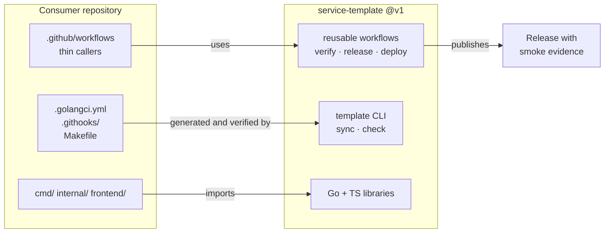

# service-template

A production service template for a Go backend with a Bun + React frontend.
It gives a new service the parts that every service needs and that nobody
wants to write twice: lint and static analysis, a test and coverage gate,
configuration, observability, a container image, a tag-driven release with
deploy evidence, and a spec-driven development workflow.

The template is not a starter kit you copy once and forget. It has three
layers, and each layer keeps working after day one:

| Layer | What it is | How a consumer stays current |
| --- | --- | --- |
| **Workflows** | Reusable `workflow_call` pipelines for verify, release, and deploy | Consumer keeps a thin caller pinned to `@v1`; fixes land centrally |
| **Materialized files** | `.golangci.yml`, git hooks, `Makefile` fragments, service skeleton | `template sync` rewrites them; `make template-check` fails CI on drift |
| **Libraries** | Small Go and TypeScript packages the skeleton imports | Ordinary dependency version bumps |

## Status

Design phase. The specs in [`specs/`](specs/README.md) define each aspect of
the template, one aspect per spec. No implementation has landed yet.

## What a consumer service gets



- **Backend.** Go 1.27, a fixed module layout, typed configuration, graceful
  shutdown, health and readiness probes, a `/version` endpoint that reports the
  built commit, OpenTelemetry traces, metrics, and trace-correlated logs.
- **Quality gates.** One canonical `golangci-lint` configuration, `go vet`,
  `govulncheck`, CodeQL, race-enabled tests, and a coverage threshold that
  fails the build instead of printing a number.
- **Frontend.** Bun, React, TypeScript, and Vite, with Vitest, an
  internationalization baseline, and a build-time prerender that emits crawlable
  HTML, a sitemap, and structured data for the public routes.
- **Delivery.** A multi-stage container image with a software bill of materials,
  build provenance, and a signature. A version tag starts one pipeline that
  verifies, builds, deploys, smokes the live surface, and only then publishes
  the release with the smoke output attached as evidence.
- **Process.** A spec directory, a lifecycle for each spec, and a documentation
  set that a new contributor can read in order.

## Design principles

**Central logic, local variability.** A reusable workflow owns ordering and
orchestration. The consumer repository declares what to build and what "live"
means through standard directories and standard scripts, not through a long
list of workflow inputs.

**Drift is detected, not hoped against.** Any file the template generates is
regenerable, and a check target proves the copy in the repository still matches
the template version it claims.

**Every gate fails loudly.** A skipped test, an unreachable database, or a
missing secret must fail the job. A gate that silently passes when it cannot
run is not a gate.

**No provider lock-in in the core.** Authentication, storage, and telemetry
backends sit behind interfaces the template defines and does not implement for
one vendor.

## Repository layout

```
.github/workflows/   reusable pipelines consumers call
specs/               design specs, one aspect per spec
```

Directories arrive as their specs land.

## Contributing

See [CONTRIBUTING.md](CONTRIBUTING.md). Security reports go through
[SECURITY.md](SECURITY.md).

## License

MIT. See [LICENSE](LICENSE).
