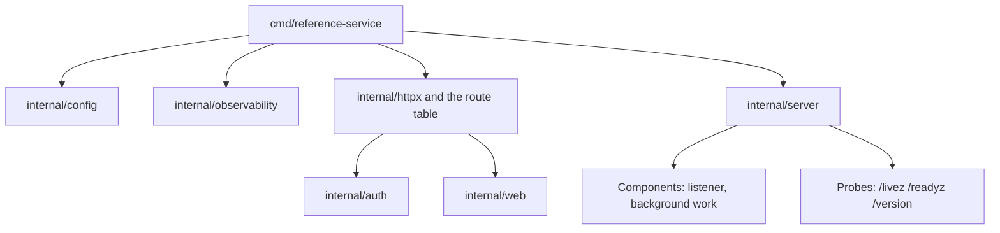
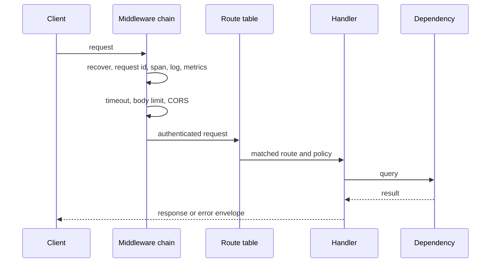

# Architecture

This document is for a new contributor. It says what the parts are, how a
request moves through them, and where new code belongs.

## The shape of the process

The process does four things in order: it loads configuration, it builds the
HTTP surface, it starts its components, and it blocks until a signal arrives.
Nothing reads the environment after start-up, so the effective configuration of
a running process is one struct and one log record.

## Packages

| Package | Owns |
| --- | --- |
| `cmd/reference-service` | The entry point. It wires the packages together and owns no logic. |
| `internal/config` | The configuration type, the loader, and the redacting secret type. |
| `internal/observability` | Traces, metrics, and the logger, with one shutdown function. |
| `internal/httpx` | The middleware chain, the error envelope, and the version helpers. |
| `internal/auth` | The identity boundary: who the caller is, and what the route allows. |
| `internal/server` | The component lifecycle, the probes, and the shutdown sequence. |
| `internal/store` | The database pool, the migrations, and the query boundary. |
| `internal/worker` | Background jobs that run beside the HTTP surface. |
| `internal/web` | Serving the built frontend from the binary. |
| `internal/version` | The build identity stamped into the binary at link time. |

A package that belongs to a feature is present when the feature is enabled. A
service with no database carries no store package, and one with no background
work carries no worker package.

A package under `internal/` is private to this repository. Business logic lives
in a package of its own beside these, not inside them.

## The path of a request

The order of the chain is a correctness property, not a preference:

1. Recovery is outermost, so a panic anywhere later becomes a logged 500 rather
   than a dropped connection.
2. The request identifier and the server span precede the access log, so every
   log record, every metric, and every error body joins to one request.
3. The timeout precedes the body limit, so a slow body is bounded in time as
   well as in size.
4. CORS precedes authentication, so a preflight, which carries no credentials,
   is answered instead of rejected.
5. Rate limiting follows authentication, so a budget attaches to the caller
   rather than to the address.

The probes are mounted outside the chain. A liveness check that authentication
or a rate limit can reject is a liveness check that reports the wrong thing.

## Errors

A handler returns a problem value, and one writer renders it. That is why every
route produces the same body, why an internal message cannot reach a client, and
why every error carries the request identifier that joins it to the logs and to
the trace. The shape is in the [interface reference](api.md).

## Configuration

Fields carry their environment variable name, their default, and their
explanation as struct tags. The example environment file and the
[configuration reference](configuration.md) are generated from those tags, so a
new field reaches both without anybody remembering to write it down.

## Adding to the service

- A new endpoint: register it on the route table with an explicit policy. A
  route with no policy is denied at request time and named by the route table
  test, so it cannot ship open by accident.
- A new dependency: start it as a component and register a readiness check for
  it, so a deployment stops rather than serving without it.
- A new configuration value: add a field with its tags, then run `make docs` and
  `make env-example`.
- A new setting of the runtime itself: it belongs in a spec first, because the
  runtime shape is shared and a local edit stops the next fix from reaching it.
