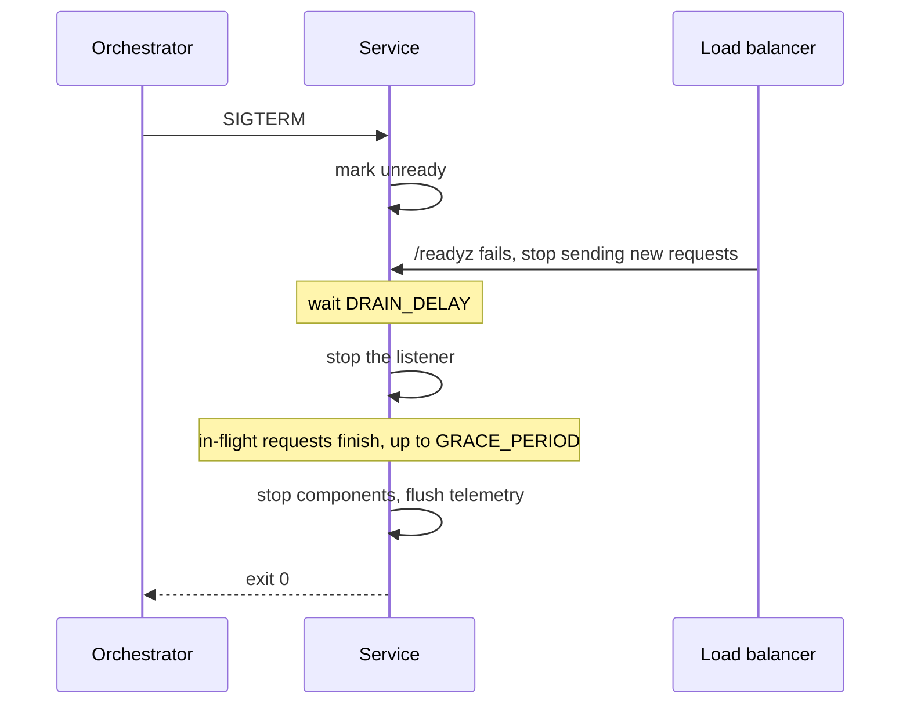

# Operations

This document is for whoever is on call. It says what the probes mean, what the
service does when it is asked to stop, which failures are common, and how to get
back to a known state.

## Probes

| Endpoint | Meaning | Orchestrator use |
| --- | --- | --- |
| `/livez` | The process is running. | Liveness. Restart when it stops answering. |
| `/readyz` | Every registered dependency is reachable and the process is not draining. | Readiness. Remove from the load balancer when it fails. |
| `/version` | The build identity: version, commit, build time, and asset hash. | Deployment evidence. |

`/readyz` names the failing dependency in its body, so a failing probe
identifies what is down and not only which replica noticed.

Do not use `/readyz` for liveness. A dependency outage would restart every
replica, which turns a recoverable outage into a restart loop.

## Shutdown

The service drains on SIGTERM. The sequence is deliberate, and the two waits are
configuration values.



`DRAIN_DELAY` covers the propagation of the readiness change through the load
balancer, so requests already dispatched are still served. `GRACE_PERIOD` bounds
how long in-flight requests may finish. Set the orchestrator termination grace
period above the sum of the two, or the process is killed mid-request.

A second SIGTERM, or a SIGINT, stops the wait and shuts down at once.

## Signals to watch

Logs are structured JSON. Every record carries the request identifier, and every
record produced inside a request carries the trace and span identifiers, so one
identifier from a user report opens the logs and the trace together.

Watch these four:

- The rate of 5xx responses, by route pattern rather than by path.
- Request duration at the high percentiles, by route pattern.
- Readiness check failures, by dependency name.
- Restart count. A restarting replica with a passing liveness probe usually
  means the termination grace period is below the drain and grace values.

## Common failures

| Symptom | Likely cause | What to do |
| --- | --- | --- |
| The process exits at start-up with a list of configuration problems | A missing or unparsable value | Read the list. It reports every problem, not the first. |
| `/readyz` fails and names a dependency | The dependency is unreachable or refusing connections | Check the dependency. The service recovers without a restart once it answers. |
| Requests are cut off at a fixed duration | The request budget is exhausted | The response is a 504 from the timeout stage. Raise the budget only after checking the handler is not waiting on something unbounded. |
| Clients see 499 in the logs | The client disconnected before the response was produced | Not a server fault. Check for a client-side timeout below the server-side one. |
| Telemetry stops arriving | The collector endpoint is unset or unreachable | Export is disabled when the endpoint is empty. The service serves traffic either way. |
| A response body is larger than expected and slow | A handler is serving an unbounded result set | Page the result. The body limit bounds requests, not responses. |

## Rollback

Roll back by deploying the previous image and confirming the build identity:

```sh
curl -s https://<host>/version
```

The reported commit must be the one you rolled back to. A deployment that
reports the previous commit but still serves the new behaviour means the rollout
did not replace every replica.

A schema migration is the case where a rollback needs thought. Migrations are
applied forward only and are written to be compatible with the release before
them, so the previous binary runs against the migrated schema. If a migration is
not backward compatible, the release notes say so, and the rollback needs the
matching down path rather than a redeploy.

## Restoring a local environment

`make dev-down` removes the containers and the volumes of the local stack, and
`make dev` rebuilds it from the seed data. Local state is disposable on purpose:
a contributor debugging their own stale volume is debugging a problem that does
not exist in the code.
