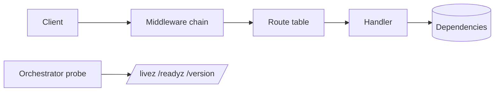

# Service baseline

## Problem

A service that begins as an empty repository acquires its runtime shape one
pull request at a time. Each decision is reasonable alone, and the result is a
process with no defined shutdown, an error body that differs per handler, and a
configuration set that only the person who added the last field knows.

The decisions that produce that shape are also invisible later. The next
contributor reads the code, cannot see the constraint that produced it, and
changes it back.

## Scope

The runtime lifecycle, the HTTP surface, the configuration boundary, and the
quality gates the repository starts with. Business behaviour is out of scope
here and belongs in a spec of its own.

## Design

The process loads one configuration value set at start-up, builds the HTTP
surface behind a fixed middleware chain, registers its dependencies as
readiness checks, and shuts down on SIGTERM by draining before it closes.

The probes bypass the chain, so a liveness check is never rejected by
authentication or by a rate limit. Every error response is written by one
writer, so a client parses one shape from every route.

## Acceptance criteria

1. The process starts from configuration alone and reports its effective
   values at start-up, with secrets redacted.
2. SIGTERM marks the process unready, waits the drain delay, stops the
   listener, and lets in-flight requests finish inside the grace period.
3. Every error response carries the problem envelope with a request
   identifier.
4. The verify pipeline runs formatting, lint, static analysis, tests, and the
   coverage gate, and fails on any one of them.

## Out of scope

Business endpoints, the data model, and the deployment target.

## Outcome

The baseline shipped as generated by the service template: the runtime
lifecycle in `internal/server`, the HTTP surface in `internal/httpx`, the
configuration boundary in `internal/config`, and the gates in `make/`.

Divergence from the design above: none at generation time. A change to any of
these parts is a new spec, because the parts are shared and a local edit stops
a template fix from reaching this repository.
