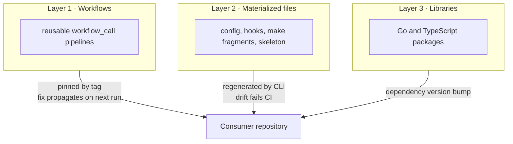

# Template contract

## Problem

A template that is copied once decays into a fork set. Every consumer edits the
copy, the copies diverge, and a central fix reaches nobody. The divergence is
not cosmetic. Two services that both claim to run the same lint configuration
can enforce different rules, and neither owner knows.

The template therefore needs a written contract before it needs any code: what
the template owns, what the consumer owns, how a consumer declares which
template version it follows, and how a mismatch becomes a build failure.

## Scope

This spec defines the contract only. It writes no workflow, no generator, and
no library.

## Design

### Three layers

Each layer has a different coupling cost and a different update mechanism.



| Layer | Owner | Consumer holds | Update path |
| --- | --- | --- | --- |
| Workflows | Template | A caller file with inputs | Re-pin or ride `@v1` |
| Materialized files | Template | The generated file, committed | `template sync`, verified by `template check` |
| Libraries | Template | An import and a version | Dependency update |

Layer 2 files are committed in the consumer repository on purpose. A developer
must be able to read the lint rules and the hooks without network access, and
tools such as editors and `golangci-lint` expect them on disk.

### Version declaration

Every consumer repository holds a `.template.yaml` at its root:

```yaml
template: github.com/latere-ai/service-template
version: v1.4.0
profile: service        # service | library | frontend-only
features:
  frontend: true
  database: true
  seo: true
```

`version` is the exact template release the materialized files came from.
`profile` and `features` select which files the generator writes. The generator
records a content digest per generated file so the check target can tell an
upstream change from a local edit.

### Ownership boundary

The template owns: the pipeline order, the quality gates, the runtime lifecycle
shape, the release evidence format, and the generated file contents.

The consumer owns: business logic, its manifests under `deploy/`, its live smoke
script, its choice of feature flags in `.template.yaml`, and any file marked as
a seed. A seed file is written once at scaffold time and never rewritten.

### Compatibility

The template publishes semantic version tags and a moving `v1` tag. Inside `v1`:

- A new generated file, a new optional workflow input, or a new library function
  is a minor release.
- A change to a generated file's content that a consumer can absorb by running
  `template sync` is a minor release.
- Removing a workflow input, renaming a required directory, or changing a gate
  so that a previously passing repository fails is a major release.

Deprecations warn for one minor release before they break.

### Layer skew

Workflows ride a moving major tag while materialized files are pinned to an
exact version, so a consumer can run a newer workflow against older generated
files. The skew is real and it must fail loudly rather than in the middle of a
release.

Two rules close it:

1. A reusable workflow declares the minimum `.template.yaml` version it needs.
   Its first job reads the consumer's version and fails with an upgrade
   instruction when the consumer is below it.
2. A workflow change that depends on a new or changed generated file raises that
   minimum. Raising the minimum is a minor release, and the release notes name
   the generated file, so an upgrade is one `template sync` away.

A workflow may never read a generated file it did not declare a minimum for.
That is what keeps rule 1 sufficient.

## Acceptance criteria

1. `docs/contract.md` states the three layers, the ownership boundary, and the
   compatibility rules.
2. The `.template.yaml` schema is documented with every field, its type, and its
   default.
3. Each later spec names the layer it belongs to.
4. The README table matches `docs/contract.md`; a test fails if they diverge.
5. A consumer below a workflow's declared minimum version fails in the first job
   with an upgrade instruction, and no later job runs.

## Out of scope

The generator itself and the drift check live in their own spec.
