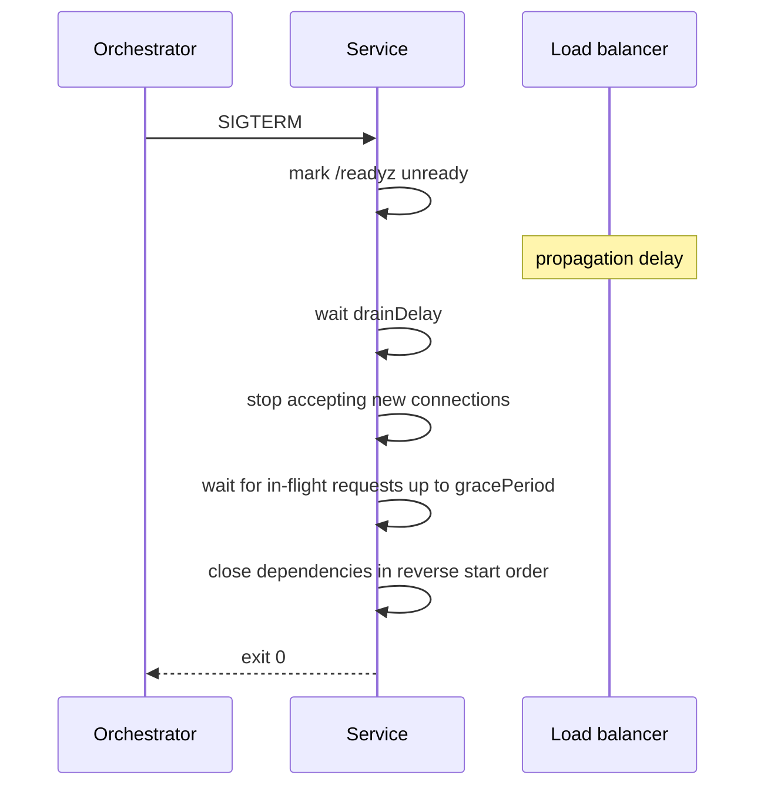

# Service runtime contract

## Problem

A deploy pipeline that smokes a live surface assumes the service exposes one.
Without a shared runtime contract, each service picks its own probe paths, its
own readiness meaning, and its own shutdown behaviour. The visible symptoms are
dropped requests during a rolling update, a pod marked ready before its
dependencies are reachable, and no way to confirm which build is serving.

Readiness is the subtle one. A readiness probe that returns 200 as soon as the
HTTP listener binds tells the orchestrator to route traffic to a process that
cannot yet reach its database.

## Scope

Layer 2 and 3. The lifecycle, the three probe endpoints, the shutdown sequence,
and the build-identity endpoint.

## Design

### Endpoints

| Path | Meaning | Failure action |
| --- | --- | --- |
| `/livez` | The process is not deadlocked | Orchestrator restarts the container |
| `/readyz` | Every registered dependency is reachable | Orchestrator removes it from the load balancer |
| `/version` | Build identity as JSON | None; informational |

`/readyz` runs registered checks with a per-check timeout and returns a JSON
body naming each check and its state, so a failing probe says which dependency
is down. `/livez` performs no dependency work, because a restart does not fix an
unreachable database and a restart loop makes the outage worse.

`/version` returns the version, commit, and build time from the version package.
The release pipeline reads it to prove the intended build is serving.

### Shutdown sequence

The drain delay exists because readiness propagation is not instantaneous. A
service that stops accepting connections the moment it receives SIGTERM rejects
requests the load balancer has already dispatched. The delay is configurable and
defaults to five seconds.

In-flight requests get up to the grace period. Requests still running when it
expires are cancelled through their context, and the service logs how many were
cut off, so the value can be tuned from evidence.

### Component lifecycle

Components register with a small run group: each has a start function and a
stop function. The group starts them in order, blocks until the first one exits
or a signal arrives, then stops them in reverse. This removes the ad hoc
goroutine and channel wiring that otherwise appears in every `main`.

### Server defaults

Read, write, and idle timeouts are always set. A server with no timeouts holds
a connection open until the client goes away, which is a denial-of-service
surface reachable with no authentication.

## Acceptance criteria

1. `/livez` returns 200 while a dependency is down; `/readyz` returns 503 and
   names the failing check.
2. On SIGTERM the service marks itself unready before it stops accepting
   connections; the ordering is asserted by a test.
3. A request in flight at SIGTERM completes when it finishes inside the grace
   period, and is cancelled with a logged count when it does not.
4. Components stop in reverse start order; a test asserts the sequence.
5. `/version` reports the values compiled into the binary.
6. The server sets read, write, and idle timeouts; a test asserts none is zero.

## Out of scope

Telemetry export and the API error format.
