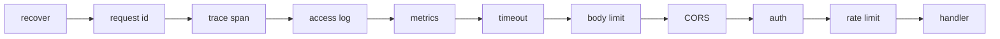

# HTTP API surface

## Problem

Without a shared surface definition, each service invents its own error body, so
a client library needs a per-service parser. Middleware order is assembled by
hand and gets it wrong in ways that are hard to see: recovery installed inside
the logging middleware means a panic never reaches the access log, and
authentication installed before request identifier assignment means an auth
failure cannot be traced.

API versioning is the third gap. A service with no versioning rule breaks
clients on its first field rename.

## Scope

Layer 2 and 3. The router, the middleware chain, the error envelope, the
versioning rule, and the machine-readable description.

## Design

### Middleware order

Order is fixed by the template because it is a correctness property, not a
preference.



Recovery is outermost so a panic anywhere inside becomes a 500 with a logged
stack rather than a dropped connection. The request identifier and the span come
before the access log so every log line and every error response can be joined
to one request. Rate limiting comes after authentication so a limit can be
applied per identity rather than per address alone.

### Error envelope

Every error response uses one shape, derived from the problem-details
convention:

```json
{
  "type": "https://errors.example.com/validation",
  "title": "Validation failed",
  "status": 422,
  "detail": "field 'email' is not a valid address",
  "instance": "req_01J2X...",
  "errors": [{"field": "email", "code": "format"}]
}
```

`instance` is the request identifier, so a user-reported error string leads
directly to the trace and the logs. Internal errors never place the underlying
message in `detail`; the message is logged, and the response carries the
identifier only.

Handlers return an error value, and one writer converts it. A handler that
writes an error body directly bypasses the envelope, so the writer is the only
exported way to render one.

### Versioning

Paths carry a major version, `/v1/...`. Inside a major version, only additive
changes are allowed: new endpoints, new optional request fields, new response
fields. Removing a field, narrowing a type, or making an optional field required
requires a new major version. A deprecated endpoint responds with a deprecation
header and a sunset date for one minor cycle before removal.

### Machine-readable description

The route table produces an OpenAPI document, and CI fails when the committed
document does not match the code. Deriving the document from the routes prevents
the common failure where the description and the implementation drift and the
description is the one clients trust.

## Acceptance criteria

1. The middleware chain is asserted in the documented order by a test that
   records entry and exit.
2. A panic in a handler yields a 500 with the envelope and an access log entry
   carrying the request identifier.
3. Every error path renders the envelope; a test walks all registered routes and
   fails on any error body that does not parse as the envelope.
4. An internal error's underlying message appears in the log and not in the
   response body.
5. A route added without updating the committed OpenAPI document fails CI.
6. A deprecated route returns the deprecation and sunset headers.

## Out of scope

Authentication mechanics and persistence.
