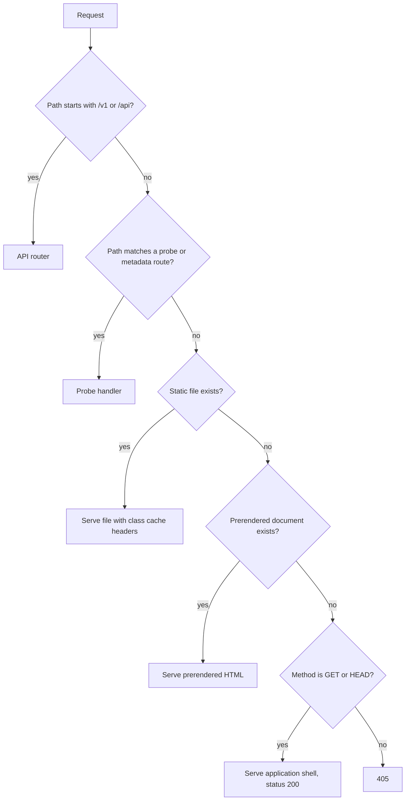

# SPA serving and asset pinning

## Problem

Serving a built frontend from the Go service looks trivial and has two recurring
defects.

The first is the deep link. A router that mounts the static handler on an
explicit path list serves the index document at the root and returns 404 for
every client-side route on a hard load or a refresh. Users reach these URLs from
bookmarks and shared links, so the failure is common and looks like data loss.
The naive repair, a catch-all registered for one HTTP method, conflicts with the
method-specific routes already registered and fails at start-up.

The second is build identity. The frontend and the binary are built at different
times. Without a check, a binary can ship an old bundle, and the deployed page
then differs from the reviewed code with nothing in the logs to show it.

## Scope

Layer 2 and 3. The serving handler, the fallback rule, embedding, and the asset
hash the release pipeline verifies.

## Design

### Route precedence

The static handler is registered as a method-agnostic catch-all at the lowest
precedence, so it never conflicts with the API routes and never shadows them.
The fallback returns the shell with status 200 for GET and HEAD only. A POST to
an unknown path returns 405 rather than an HTML document, because returning
markup to a programmatic client hides the real error.

An unknown path under the API prefix returns the JSON error envelope, never the
shell. This keeps a mistyped endpoint from returning 200 with HTML, which is the
form of the bug that costs the most debugging time on the client side.

### Embedding

The built output is embedded with the standard embedding directive from a fixed
directory. A placeholder file keeps that directory present in version control so
a fresh clone compiles before the frontend is built. The build target refuses to
produce a release binary when only the placeholder is present, so an empty
bundle cannot ship.

### Asset pinning

The build records the hashed entry asset name in the binary. `/version` reports
it alongside the commit. After deploy, the smoke step fetches the live document
and asserts the referenced entry asset matches the one the release built. This
turns "the wrong bundle is serving" from an unnoticed condition into a failed
release.

### Compression and range requests

Assets are served with content negotiation for precompressed variants produced
at build time, and range requests are supported for media. Entity tags come from
the content hash, so revalidation is cheap and correct.

## Acceptance criteria

1. A hard load of a client-side route returns 200 and the shell.
2. A POST to an unknown non-API path returns 405, not the shell.
3. An unknown path under the API prefix returns the JSON error envelope.
4. Registering the catch-all does not conflict with existing routes; the server
   starts and a test asserts precedence for a path that could match both.
5. A release build with only the placeholder present fails.
6. `/version` reports the entry asset name, and the smoke step fails when the
   live document references a different one.
7. Cache headers follow the asset class table.
