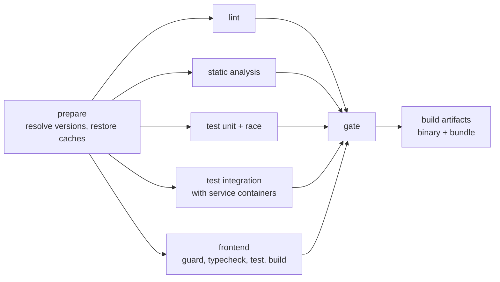

# Verify pipeline

## Problem

Every repository writes its own pre-merge workflow, so the gates differ, the
caching differs, and a fix to one does not reach the others. A repository can
also appear to have a gate that never runs, because a path filter or a matrix
condition excludes it, and a skipped required check is reported as neutral
rather than as a failure.

## Scope

Layer 1. One reusable `workflow_call` workflow that every consumer calls, its
job graph, and its caching.

## Design

### Job graph

Jobs run in parallel after `prepare` because they are independent. The `gate`
job is the single required check: it evaluates the result of every upstream job
and fails when any of them failed, was cancelled, or was skipped. A skipped
required job is a failure, which closes the path filter loophole.

The `build` job produces the binary and the bundle as artifacts. The release
pipeline reuses them rather than rebuilding, so the released artifact is the
verified one.

### Inputs

Inputs stay few, and variability lives in repository conventions. The workflow
takes the service name, the main package path, feature flags read from
`.template.yaml`, and nothing that duplicates information already on disk.

### Caching

The Go module cache, the build cache, and the frontend dependency cache are
keyed on the lockfile digests, with a restore-only fallback on the default
branch. Cache is a speed optimization and never a correctness input: the
frozen-lockfile install and the digest-keyed cache together make a cache hit and
a cache miss produce the same result.

### Reporting

Each job writes a summary block: findings by linter, coverage by package,
advisories, and bundle size with the change against the default branch. The
summary is where a reviewer reads the result, so it must contain the numbers and
not only a pass mark.

### Concurrency

Runs for one branch cancel their predecessors. Runs on the default branch never
cancel, because their results feed the release path.

## Acceptance criteria

1. A consumer needs one caller file of fewer than twenty lines.
2. A failure in any upstream job fails the gate job.
3. A skipped upstream job fails the gate job; a test forces a skip and asserts
   the failure.
4. Artifacts from the build job are consumable by the release pipeline.
5. A cache miss and a cache hit produce identical results for one commit.
6. The summary reports coverage per package, findings per linter, and bundle
   size change.
7. Branch runs cancel predecessors; default-branch runs do not.
