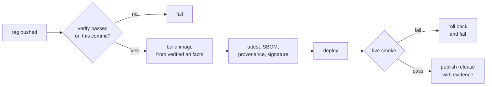

# Tagging and release

## Problem

Releases cut by hand are inconsistent: the tag sometimes points at a commit that
never passed verification, the notes are written from memory, and the published
release states that a version shipped without any proof that the version is
running. "Released" then means "a tag exists", which is not the property anyone
actually wants.

## Scope

Layer 1. Version derivation, the tag gate, the pipeline order, and the evidence
attached to the published release.

## Design

### Version derivation

Versions follow semantic versioning. The next version is derived from the
conventional-commit prefixes since the previous tag: a breaking marker bumps the
major, a feature bumps the minor, anything else bumps the patch. Derivation runs
in a dry-run mode on every default-branch build and prints the version the next
release would take, so the number is never a surprise.

Tagging is deliberate. Automation computes and proposes; a maintainer triggers.
A pipeline that tags on every merge removes the ability to group changes into a
meaningful release, and a version number is a communication device.

### The tag gate

Before anything is built, the pipeline asserts that the exact commit the tag
points at has a passing verify run. Not the branch, not a later commit, that
commit. A release built from an unverified commit is the failure this gate
exists to prevent, and it is easy to hit when a tag is pushed while CI is still
running.

### Order

The release is published last. Publishing before the smoke passes announces a
version that may not be serving, and a release note is the thing downstream
consumers trust.

### Evidence block

The published release carries generated notes plus an evidence block:

| Field | Content |
| --- | --- |
| Commit | Full SHA and the verify run that passed it |
| Image | Registry reference pinned by digest |
| Attestations | Bill of materials, provenance, and signature verification results |
| Deploy | Target, rollout completion time, replica count |
| Live check | Each smoke assertion with its observed value |
| Build identity | Version, commit, and entry asset reported by the live service |

The evidence is machine-generated from the run. A field that cannot be filled
fails the release rather than printing "unknown", because an evidence block with
gaps is worse than none: it looks like proof.

### Pre-releases and rollback

A tag with a pre-release suffix deploys to the pre-production target and
publishes a pre-release. Rollback re-runs the deploy step with the previous
released digest, and produces its own evidence block, so a rollback is as
traceable as a release.

## Acceptance criteria

1. A tag on a commit with no passing verify run fails before any build.
2. The derived version matches the commit history in all three bump cases.
3. The release is published only after the smoke step passes.
4. The evidence block contains every field, and a missing field fails the run.
5. The live build identity in the evidence matches the tagged commit.
6. A failed smoke rolls back and leaves no published release.
7. A pre-release tag targets pre-production and publishes as a pre-release.
