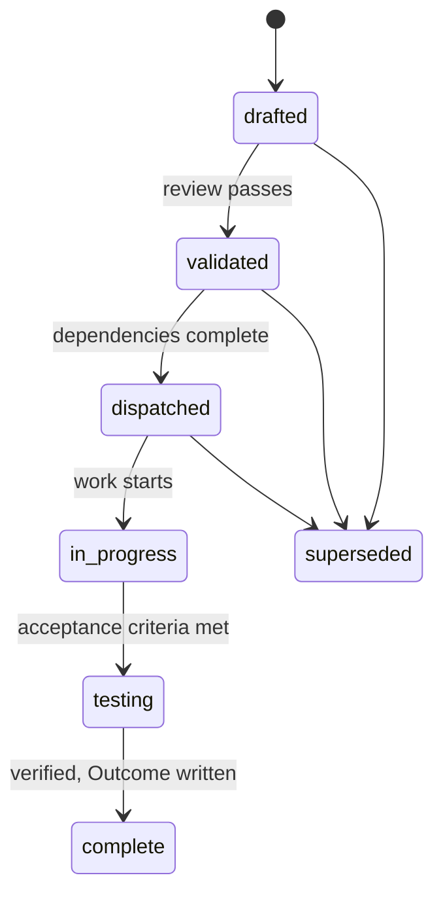

# Spec-driven workflow

## Problem

Design decisions that live only in a pull request description are unfindable six
months later. The next person reads the code, cannot see which constraint
produced it, and changes it. Then the original problem returns.

A spec directory with no format and no lifecycle has the opposite failure: specs
accumulate, none says whether it shipped, and the directory becomes an archive
of intentions that no longer matches the code.

## Scope

Layer 2. The spec file format, the lifecycle states, the directory layout, and
the validator.

## Design

### Format

One file per aspect, `specs/NNN-name.md`, with frontmatter:

```yaml
title: <one line, states the aspect and the approach>
status: drafted | validated | dispatched | in-progress | testing | complete | superseded
depends_on: [<paths to other specs>]
affects: [<paths this spec changes>]
created: <ISO date>
author: <handle>
trigger: <the condition that makes this spec worth doing now>
```

The body follows a fixed order: Problem, Scope, Design, Acceptance criteria, Out
of scope. Problem comes first because a spec that starts with a solution hides
the reasoning that justifies it. Acceptance criteria are testable statements,
not intentions, so a reviewer can check whether the work is done without
interpretation.

### Lifecycle



A spec reaches `complete` only with an Outcome section that records what shipped
and where it diverged from the design. The divergence record is the part that
keeps the directory honest: a spec that describes something the code does not do
is worse than no spec.

### Numbering and retirement

Numbers are stable identifiers, never reused and never reassigned, so a
`depends_on` reference keeps resolving. A terminal spec moves into an archive
subdirectory keeping its number. Open specs at the top level are the work
queue, which makes "what is left" a directory listing rather than a document
somebody maintains.

### Index

`specs/README.md` lists every spec with its status. The index is generated from
the frontmatter, so it cannot disagree with the files.

### Validator

A check target enforces: required frontmatter fields present, status from the
allowed set, `depends_on` targets exist, no dependency cycle, no spec marked
dispatched whose dependencies are incomplete, no complete spec without an
Outcome, and the index matching the files. It runs in the verify pipeline.

## Acceptance criteria

1. A spec missing a required frontmatter field fails the validator.
2. A dependency cycle fails the validator, naming the cycle.
3. A spec marked dispatched with an incomplete dependency fails.
4. A spec marked complete with no Outcome section fails.
5. A stale index fails and regenerates deterministically.
6. Archiving a spec preserves its number and leaves inbound references
   resolvable.
