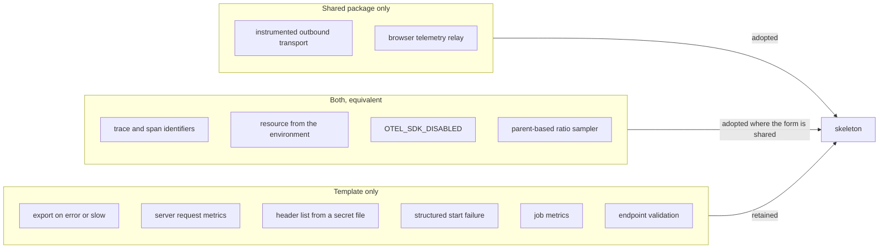

# Telemetry consolidation onto the shared OpenTelemetry package

## Problem

Eleven repositories import `latere.ai/x/pkg/otel`. The template imported none of
it and wired the OpenTelemetry SDK itself. This matters more here than in any
single service, because the template is a generator: whatever it ships becomes
the telemetry of every repository scaffolded from it, and a backend change then
has to be made once per scaffolded repository instead of once.

The consolidation was expected to be a deletion. It is not. The template's
implementation is a superset of the shared package on six axes, and the shared
package is a superset of the template on one. Switching the whole telemetry
start-up over would remove capabilities that exist because a production incident
needs them, and it would replace a released dependency of the template with a
weaker one.

This spec records what moved, what did not, why, and what has to land in
`latere.ai/x/pkg/otel` before the rest can follow.

## Scope

Layer 3. Which telemetry code the template owns and which it takes as a
dependency. It changes no signal names, no attribute keys, and no configuration
surface.

## Design

### What the two implementations cover

### Adopted

**The outbound client.** The template shipped no instrumented outbound
transport, so a scaffolded service calling another service produced two traces
with no edge between them. Spec 009 already promised client spans for outbound
calls and nothing implemented them. The assembly now carries a client built by
`otel.HTTPClient`, at `skeleton/cmd/service/main.go:307`, with the deadline set
at the call site because the shared client carries none. The behaviour is
asserted end to end in `skeleton/cmd/service/outbound_test.go`: a recorded
client span, a `traceparent` the receiving server can extract, and the received
parent span identifier equal to the client span.

**The correlation identifiers.** `skeleton/internal/observability/logging.go:94`
now reads `otel.TraceIDs` instead of rendering the span context itself. A
backend joins a log line to a trace by exact string match, so two renderings of
the same identifier are a join that silently returns nothing. Fixing the form in
one place is the whole value.

### Retained, with the reason

Ranked by what the loss would cost.

**1. Export on error or slow, regardless of the ratio.**
`skeleton/internal/observability/sampler.go:38-70` holds `retainProcessor`, and
`sampler.go:18-29` holds the `AlwaysRecord(ParentBased(...))` sampler that makes
it possible: a span the ratio dropped is still built and still handed to the
processors, so the processor can export it when the span failed or ran past
`SlowRequest`. It is wired at
`skeleton/internal/observability/observability.go:250-257`.

`otel.Setup` builds its tracer provider with `trace.WithBatcher` and exposes no
span-processor option, no sampler option, and no provider accessor. There is one
global tracer provider and a wrapper cannot add a processor to it. Under the
shared package's 0.2 default ratio, four of every five failing requests would
leave no trace. There is no mitigation, so the template keeps its own provider.

**2. The collector header list through the configuration precedence.**
`skeleton/internal/observability/observability.go:348-371` parses the header
list with the percent-decoding the protocol defines, and
`skeleton/cmd/service/main.go:471` feeds it from configuration, which resolves a
value from the environment, then from the file named by `<NAME>_FILE`
(`skeleton/internal/config/load.go:33`), then from the declared default.

The shared package builds every exporter as `otlptracehttp.New(ctx)` with no
options, so the exporter reads the environment and nothing else. A header
mounted as a secret file is unreachable. This is the item that blocks the
migration itself: both candidate backends authenticate by header, and an
orchestrator mounts a credential as a file rather than as an environment
variable precisely so it does not appear in a process listing.

**3. Structured start failure with a partial-start unwind.**
`skeleton/internal/observability/observability.go:163-215` returns an error the
caller acts on, and `observability.go:178-183` unwinds every provider that
already started when a later one fails. A provider that started holds a
connection and a background goroutine, so an abandoned partial start is a leak.

`otel.Setup` writes the failure with `log.Printf` and returns a no-op shutdown,
which means a service with a misconfigured exporter starts, reports healthy, and
emits nothing. The template treats that as a start-up failure.

**4. Server request metrics.**
`skeleton/internal/httpx/metrics.go:23` records `http.server.request.duration`
with explicit bucket boundaries and `metrics.go:36` records
`http.server.active_requests`, both labelled by the route pattern the span stage
resolved rather than by the request path.

The shared package's `Handler` takes a caller-supplied `WithMetricsHook`
instead. Adopting it would mean writing these two instruments against that hook,
which is possible, but it cannot be done today for the reason below.

**5. Job metrics.** `skeleton/internal/worker/telemetry.go:52` records
`worker.job.execution.duration` and `telemetry.go:62` records
`worker.job.time_since_last_success` as an observable gauge whose callback is
unregistered at `telemetry.go:102`. The shared package has no worker concept.
This is service-domain instrumentation and it is correct where it is.

**6. Endpoint scheme validation.** `skeleton/internal/config/config.go:158-175`
rejects a collector endpoint whose scheme is not http or https, one with no
host, and a header list set with no endpoint, before the listener binds. The
shared package validates nothing. This is configuration validation and belongs
in the configuration package, not in a telemetry library.

### A seventh item the switch surfaced

`otel.Handler` wraps `otelhttp.NewHandler`, which emits its own
`http.server.request.duration` through the global meter provider, and `Handler`
exposes no meter-provider option. Measured directly against a manual reader with
both in the chain, the collection yields two streams named
`http.server.request.duration` under different instrumentation scopes, with
different attribute sets and no SDK conflict to make the duplication visible.
Any dashboard summing by metric name double counts.

This is why the template's server span stage,
`skeleton/internal/httpx/trace.go:37`, stays as it is. It also resolves the
route pattern *before* the handler runs and publishes it on the context, which
the access log stage, the metrics stage, and the error envelope all read.
`otel.Handler` reads `r.Pattern` after the handler returns, which is too late
for every one of those readers.

### Considered and rejected

Calling `otel.SetupLogs` for the log path alone, keeping the template's tracer
and meter providers. It carries the same header and resource losses at a smaller
blast radius, and it splits resource construction across two packages so the
three signals could disagree on their attributes. The correlation between
signals is the thing the resource exists to provide.

### Four capabilities have since been released

This spec was written against `latere.ai/x/pkg v0.43.0`, the newest tag at the
time, which honoured neither `OTEL_SDK_DISABLED` nor
`OTEL_RESOURCE_ATTRIBUTES`, stamped no trace context on the local log stream,
recorded no handler panic, and followed semantic conventions v1.26.0 against
the template's v1.37.0. Those were the reason the switch stopped where it did:
a generator cannot pin a pseudo-version, so the capabilities existing only in
untagged commits were the same as not existing.

`v0.44.0` released all four, and moved semantic conventions to v1.41.0, which
is ahead of the template. The template's own equivalents
(`observability.go:314-319` for the kill switch, `resource.go:46` for the
environment resource, `logging.go:94` for the local stream, and
`httpx/trace.go:54-59` for panics) are therefore no longer the only source, and
those four are candidates for deletion in a follow-up.

That does not unblock the rest. The two P0 items below are untouched by
`v0.44.0`, and they are what the remaining code exists for: without a
span-processor seam there is no way to express error and slow-trace retention,
and without explicit endpoint and header fields a collector credential mounted
as a file cannot reach the exporter.

## Recommended porting order for `latere.ai/x/pkg/otel`

Ranked, because the order decides whether the migration is unblocked.

| Rank | Capability | Shape |
| --- | --- | --- |
| P0 | Span-processor and sampler seam on `Setup` | Options that let a caller add a processor and choose the sampler, so error and slow retention is expressible |
| P0 | Explicit endpoint and headers in `Config` | Fields the caller fills from its own configuration, falling back to the environment when empty |
| P1 | Structured error and partial-start unwind | `Setup` returns an error and stops what it started, instead of `log.Printf` and a no-op |
| P1 | Meter-provider option on `Handler` | Lets a caller silence the built-in instruments, which is the precondition for P2 |
| P2 | Server request metrics inside `Handler` | Replaces `WithMetricsHook` for the common case; only after P1, or it is the duplication above |
| P2 | Build identity on the resource | Commit and build time, so a signal is attributable to a build and not only to a tag |

Two of the six should **not** be ported. Job metrics are service-domain and
belong to whatever runs the jobs. Endpoint validation is configuration
validation and belongs in the configuration layer, where the failure can be
reported against the variable name that carried it.

## Acceptance criteria

1. An outbound call made with the assembly's client produces a client span and
   the receiving server extracts a span context whose trace identifier matches
   the caller's; a test asserts both against a span recorder and a composite
   propagator, with no assertion on the transport's type.
2. The outbound client carries a deadline; a test asserts it.
3. A log record emitted inside a request still carries `trace_id` and `span_id`
   on the local stream after the identifiers are read from the shared package.
4. `skeleton/` and `example/` build, vet, test, and gofmt clean, and a fresh
   generation matches the committed reference service.
5. Every skeleton file the template compiles is declared in a manifest fragment,
   so a scaffolded repository inherits the tests along with the code.

## Out of scope

The browser telemetry relay. `otel.TelemetryProxy` would give the frontend
feature a same-origin route for browser OTLP payloads, which the template does
not have. Mounting it is a change to the public route table and to the
authentication policy of every scaffolded service, which is a product decision
and not part of a consolidation.

Changes to `latere.ai/x/pkg`. The porting table above is the hand-off; the work
belongs to that repository.

## Residual risk

With the template's own provider retained, a scaffolded service still has two
places a backend change can land: its dependency version and its own
`internal/observability`. The one-place-to-change goal is not met, and it stays
unmet until the two P0 items land and the template can build its provider
through the shared package rather than beside it.
