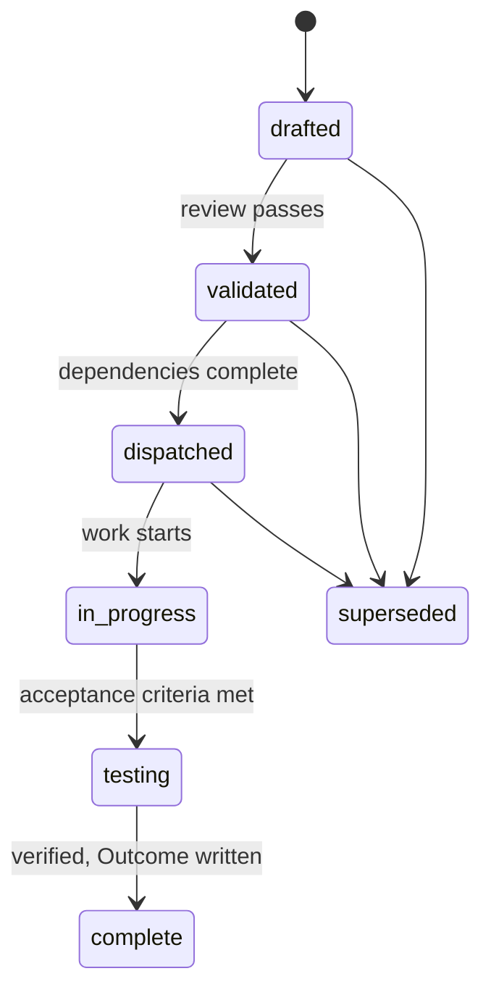
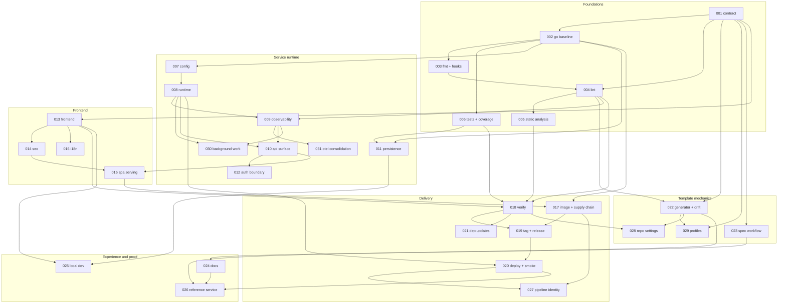

# Specs

Design specs for the service template. One spec covers one aspect. A spec states
the problem before the design, and its acceptance criteria are testable
statements, so "done" needs no interpretation.

## Layout

Flat files `specs/NNN-name.md` in one number space. Numbers are stable
identifiers and are never reused. Open specs sit at the top level and are the
work queue. A terminal spec moves to `specs/.archive/` keeping its number, so
`depends_on` references keep resolving.

## Lifecycle

## Reading order

Spec 001 defines the contract every other spec builds on. Read it first. The
remaining 30 specs group into six sections that follow the dependency order.

## Dependency graph

Edges show the specs a spec builds on. Sections run roughly top to bottom.

## Foundations

| Spec | Aspect | Status |
| --- | --- | --- |
| [001](001-template-contract.md) | Template contract: layers, versioning, consumer agreement | drafted |
| [002](002-go-module-baseline.md) | Go module layout, toolchain pin, build, version stamping | drafted |
| [003](003-formatting-and-hooks.md) | Formatting and the pre-commit hook contract | drafted |
| [004](004-lint-baseline.md) | One canonical golangci-lint configuration | drafted |
| [005](005-static-analysis-and-vulnerability-scanning.md) | vet, govulncheck, and code scanning | drafted |
| [006](006-test-standards-and-coverage-gate.md) | Test tiers, required dependencies, coverage gate | drafted |

## Service runtime

| Spec | Aspect | Status |
| --- | --- | --- |
| [007](007-configuration-and-secrets.md) | Typed configuration, precedence, redaction, boot validation | drafted |
| [008](008-service-runtime-contract.md) | Lifecycle, probes, drain, build identity | drafted |
| [009](009-observability.md) | Traces, metrics, and trace-correlated logs | drafted |
| [010](010-http-api-surface.md) | Routing, middleware order, error envelope, versioning | drafted |
| [011](011-persistence-and-migrations.md) | Schema versioning and a test database that must exist | drafted |
| [012](012-authentication-boundary.md) | Pluggable identity with no provider in the core | drafted |
| [030](030-background-work-runtime.md) | Scheduled jobs, queue consumers, one-shot commands | drafted |
| [031](031-otel-consolidation.md) | Which telemetry the template owns and which it depends on | drafted |

## Frontend

| Spec | Aspect | Status |
| --- | --- | --- |
| [013](013-frontend-baseline.md) | Bun, React, TypeScript, Vite, Vitest | drafted |
| [014](014-seo-and-static-distribution.md) | Prerender, metadata, sitemap, cache policy | drafted |
| [015](015-spa-serving-and-asset-pinning.md) | Deep links, embedding, asset hash verification | drafted |
| [016](016-internationalization.md) | Catalogs, completeness gate, negotiation, formatting | drafted |

## Delivery

| Spec | Aspect | Status |
| --- | --- | --- |
| [017](017-container-image-and-supply-chain.md) | Reproducible image, bill of materials, provenance, signature | drafted |
| [018](018-verify-pipeline.md) | The reusable pre-merge pipeline | drafted |
| [019](019-tagging-and-release.md) | Version derivation, tag gate, release evidence | drafted |
| [020](020-deploy-and-smoke.md) | Rollout contract, live verification, rollback | drafted |
| [021](021-dependency-updates.md) | Grouped updates and template version notification | drafted |
| [027](027-pipeline-identity-and-secrets.md) | Federated pipeline credentials and least privilege | drafted |

## Template mechanics

| Spec | Aspect | Status |
| --- | --- | --- |
| [022](022-generator-and-drift-check.md) | Materializing generated files and proving they match | drafted |
| [023](023-spec-driven-workflow.md) | Spec format, lifecycle, validator | drafted |
| [028](028-repository-settings.md) | Branch protection, ownership, and merge rules as code | drafted |
| [029](029-profiles.md) | What service, library, and frontend-only repositories generate | drafted |

## Developer experience

| Spec | Aspect | Status |
| --- | --- | --- |
| [024](024-documentation-set.md) | Audience-separated docs with an accuracy check | drafted |
| [025](025-local-development-environment.md) | One command to a running stack | drafted |
| [026](026-reference-service.md) | End-to-end example that proves the whole template | drafted |

## Suggested build order

1. **001** alone. Everything else references it.
2. **002 to 006**, then **022** and **029**. The generator and the profiles
   arrive early so later specs materialize their files through the generator
   rather than being retrofitted into it.
3. **018** and **028**. Once gates exist, wire them centrally and make them
   binding. A gate that is not a required check is advisory.
4. **007 to 012**, and **030** when the consumer runs background work.
5. **013 to 016**. The frontend.
6. **017, 019, 020**, then **027** and **021**. The pipelines are built first,
   then 027 replaces their bootstrap credentials with federated identity and
   least-privilege grants before any of them run against production.
7. **023 to 026**. Process, documentation, and the proof.
